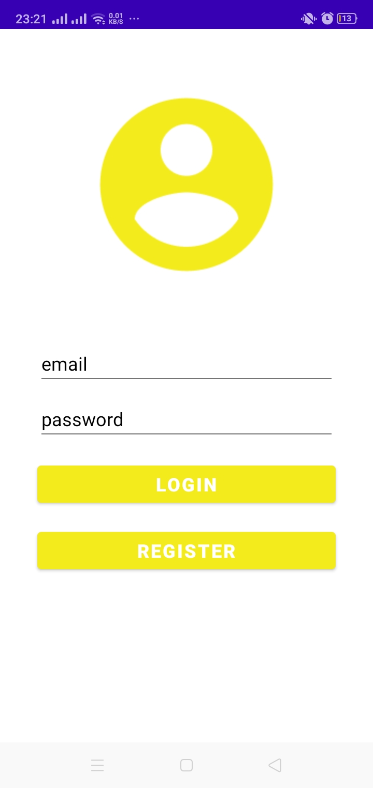
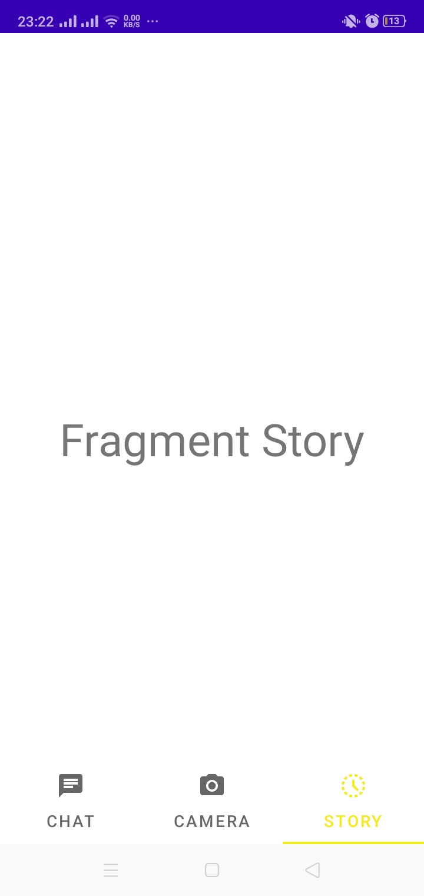

# Android-Login-and-Register-with-Firebase-Authentication

A simple login and register application using Firebase Authentication built on Android Studio. 
This project include Splash Screen, Main Activity (Fragment Chat, Camera and Story)

## Application contains five activities

 - [Splash Screen Activity](https://github.com/imperiaprestise/Android-Login-and-Register-with-Firebase-Authentication/blob/main/app/src/main/java/ac/id/unri/appchat/SplashScreenn.java)
 - [Login Activity](https://github.com/imperiaprestise/Android-Login-and-Register-with-Firebase-Authentication/blob/main/app/src/main/java/ac/id/unri/appchat/LoginScreen.java)
 - [Register Activity](https://github.com/imperiaprestise/Android-Login-and-Register-with-Firebase-Authentication/blob/main/app/src/main/java/ac/id/unri/appchat/SplashScreenn.java)
  - [Main Activity](https://github.com/imperiaprestise/Android-Login-and-Register-with-Firebase-Authentication/blob/main/app/src/main/java/ac/id/unri/appchat/MainActivity.java)
 - [Fragment Chat, Camera, Story](https://bulldogjob.com/news/449-how-to-write-a-good-readme-for-your-github-project)

## Activity looks similar to : 

    
    
    

    
    
    

## To connect Firebase to your Android application :
#### Refer this
> [Connect Firebase using Android Studio](https://firebase.google.com/docs/android/setup)

